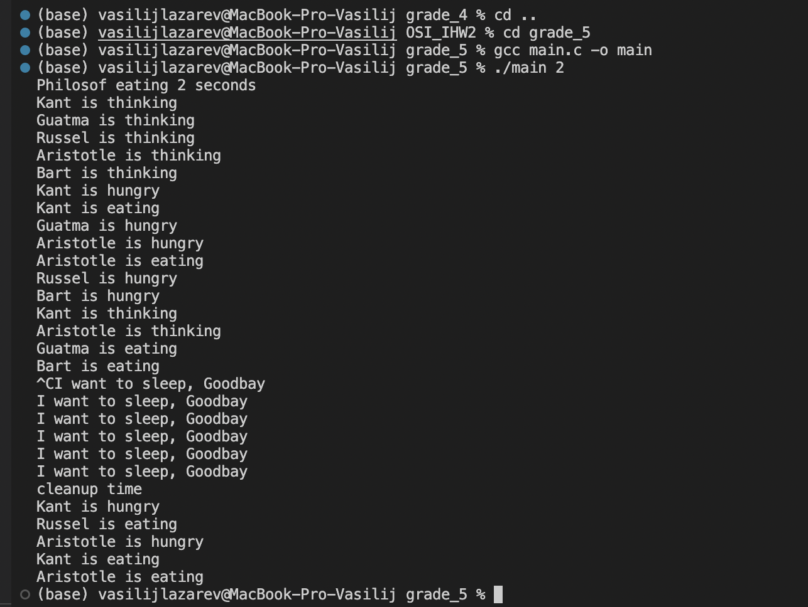
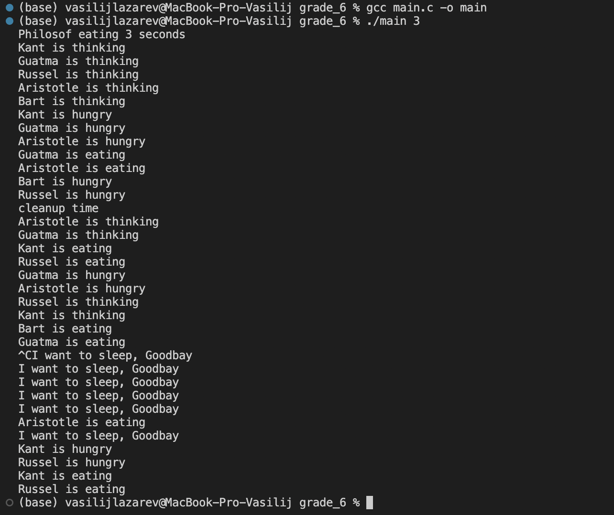
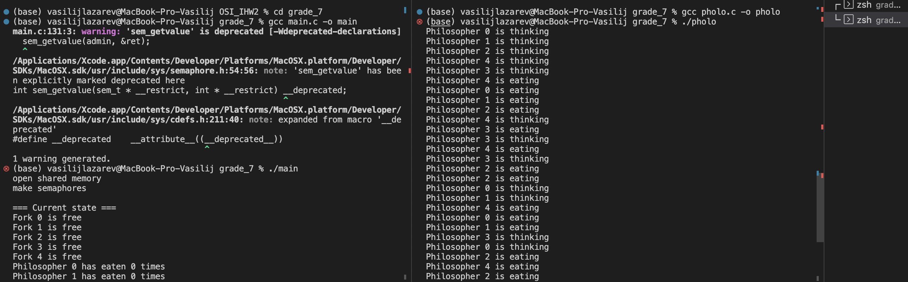
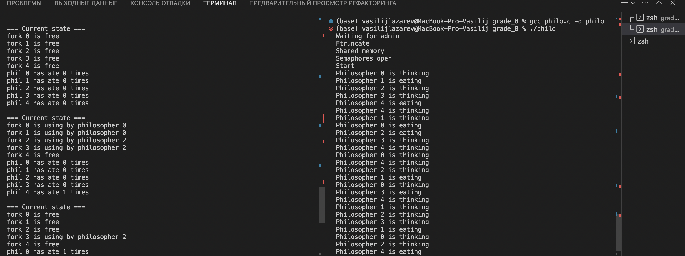

# ИДЗ-2 Вариант 5 Лазарев Василий БПИ212

## Условие задачи:
```
Задача об обедающих философах. Пять философов сидят возле круглого стола. Они проводят жизнь, чередуя приемы пищи и
размышления. В центре стола находится большое блюдо спагетти.
2
Спагетти длинные и запутанные, философам тяжело управляться с ними, поэтому каждый из них, что бы съесть порцию, должен пользоваться двумя вилками. К несчастью, философам дали
только пять вилок. Между каждой парой философов лежит одна вилка, поэтому эти высококультурные и предельно вежливые
люди договорились, что каждый будет пользоваться только теми
вилками, которые лежат рядом с ним (слева и справа). Написать
программу, моделирующую поведение философов Программа должна избегать фатальной ситуации, в которой все философы
голодны, но ни один из них не может взять обе вилки (например,
каждый из философов держит по одной вилки и не хочет отдавать
ее). Решение должно быть симметричным, то есть все
процессы–философы должны выполнять один и тот же
код.
```


Планируемая оценка: ~8

### Критерии на оценку 4:

#### Компиляция и запуск программы:
```c++
gcc program1.c
./a.out {eat time}
```

Пример: ./a.out 3
=> каждый философ будет кушать 3 секунды

### Что происходит?
Этот код использует процессы (fork), так как это больше соответствует вашему изначальному заданию. Процессы синхронизируются с использованием неименованных POSIX семафоров, расположенных в разделяемой памяти.

Как решена проблема зацикливания?
O:Мы нумеруем вилки номерами (понятное дело разными). Каждый философ берет сначала вилку с наименьшим номером, затем вилку с наибольшим номером. Этот подход гарантирует, что один из философов сможет взять обе вилки и начать есть.

Философы едят случайное количество времени, в пределах 1-8 секунд. Это задается с помощью аргументов командной строки при запуске


### Удаление семафоров и очищение разделяемой памяти
Для очистки семафоров и разделяемой памяти используются следующие функции:

1)Для очистки семафоров и разделяемой памяти используются следующие функции:

sem_destroy: Эта функция уничтожает семафор, освобождая ресурсы, связанные с ним. В коде она вызывается в цикле после завершения работы всех процессов-философов:
```c++
for (i = 0; i < NUM_PHILOSOPHERS; i++) {
    sem_destroy(&forks[i]);
}

```
2)munmap: Эта функция отображает разделяемую память. Она вызывается после того, как программа завершает работу с разделяемой памятью, чтобы освободить ресурсы. В коде она вызывается после завершения работы всех процессов-философов:
```C++
munmap(shared_data, shared_size);
```
3)shm_unlink: Эта функция удаляет объект разделяемой памяти, связанный с именем. В коде она вызывается после завершения работы всех процессов-философов:
```C++
shm_unlink("/philosopher_shm");
```

### Корректное завершение програмы
Корректное завершение осуществляется с помощью сигналов:
```C++
int running = 1;

void signal_handler(int signum) {
    if (signum == SIGINT) {
        printf("I want to sleep, Goodbay\n");
        running = 0;
    }
}
```
При нажатии CTRL + C программа завершается с возвратным кодом 0.
## Критерии на оценку 5:

Теперь используем именованные POSIX семафоры и разделяемую память стандарта POSIX.Каждый семафор создается с уникальным именем, и после создания сразу же отсоединяется от системы имен, чтобы предотвратить утечки ресурсов. Затем для каждого философа создается процесс, который выполняет функцию `philosopher_func`. После завершения работы все семафоры закрываются с помощью функции `sem_close`. 

Идейная составляющая для предотвращения зацикливания не меняется.
### Пример работы:



## Критерии на оценку 6:

Теперь используются семафоры и разделяемая память в стандарте System V. Мы создаем разделяемую память с помощью shmget, а затем получаем указатель на эту память с помощью shmat. Затем используется semget для создания массива семафоров. Вместо sem_wait и sem_post, используются semop для управления семафорами. В конце, мы освобождаем разделяемую память и удаляем семафоры.

Идейная составляющая для предотвращения зацикливания не меняется.

### Пример работы:


## Критерии на оценку 7:

В этом коде реализация задачи об обедающих философах обходит зацикливание (deadlock) с помощью именованных семафоров (POSIX semaphores) для синхронизации доступа к разделяемым ресурсам, таким как вилки и информация о философах.

Зацикливание по алгоритму:

Если философ готовит вилки для еды, он проверяет доступность обеих вилок. Если обе вилки доступны, он забирает их и устанавливает флаг isUsingFork в значение 1. Если же вилки недоступны, философ продолжает думать.

Когда философ заканчивает есть, он освобождает обе вилки и увеличивает свой счетчик приемов пищи на 1, а также устанавливает флаг isUsingFork в значение 0.

Философы действуют независимо друг от друга, а их действия синхронизируются с помощью семафора. В итоге, когда один философ заканчивает есть и освобождает вилки, другой философ может их забрать и начать есть.

Таким образом, зацикливание (deadlock) предотвращается с помощью семафоров, которые контролируют доступ к вилкам и не позволяют философам забирать вилки, если обе недоступны. Это гарантирует, что философы не будут заблокированы и => зацикливаний нет.

Компиляция и запуск:
```C++
gcc main.c -o main
./main
```

Второй терминал:
```C++
gcc philo.c -o philo
./philo
```

(Т.к. основная моя рабочая машина на MacOs, то периодически будут warning'и из-за другого устройства arm, на скрине это видно, протестировав на ubuntu - всё окей)

### Пример работы




## Критерии на оценку 8:

Множество независимых процессов взаимодействуют с использованием именованных POSIX семафоров. Обмен данными ведется через разделяемую память в стандарте POSIX.
В коде используются функции именованных семафоров POSIX, такие как sem_open, sem_close, sem_unlink, sem_wait и sem_post. Также для работы с разделяемой памятью используются функции стандарта POSIX, такие как shm_open, mmap, munmap, shm_unlink и close.

Запуск и компиляция аналогична прошлому пункту

### Пример работы

